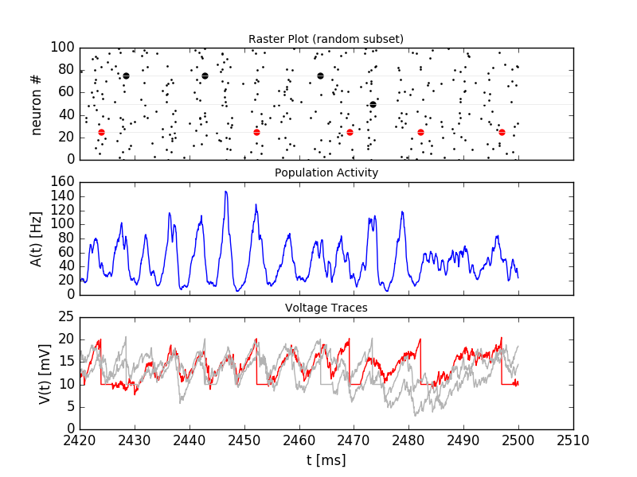
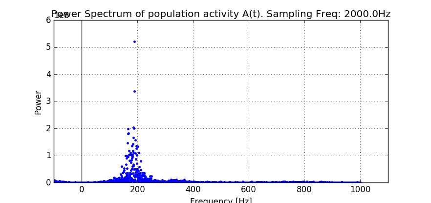
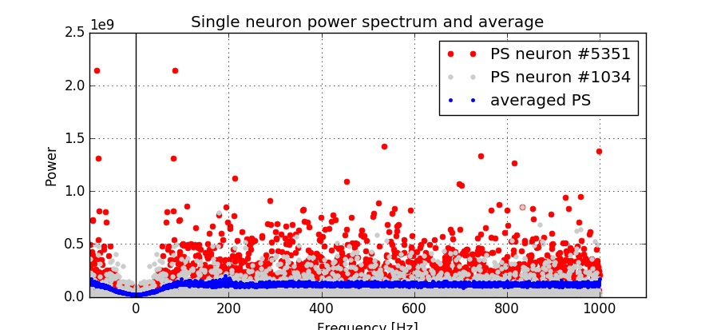

Network of LIF neurons (Brunel)
===============================

In this exercise we study a well known network of sparsely connected Leaky-Integrate-And-Fire neurons (Brunel, 2000).

**Book chapters**

The Brunel model is introduced in `Chapter 13 Section 4.2 <http://neuronaldynamics.epfl.ch/online/Ch13.S4.html>`_ . The network structure is shown in figure 13.6b. Read the section "Synchrony, oscillations, and irregularity" and have a look at Figure 13.7. For this exercise, you can skip the explanations related to the Fokker-Planck equation.

**Python classes**

The module :mod:`.brunel_model.LIF_spiking_network` implements a parametrized network. The figure below shows the simulation result using the default configuration.

.. figure:: exc_images/Brunel_Spiking_LIF.png
   :align: center

   Simulation result. Top: raster plot of 150 randomly selected neurons. Three spike trains are visually highlighted. Middle: time evolution of the population activity A(t). Bottom: Membrane voltage of three neurons. The red color in the top and bottom panels identifies the same neuron.

To get started, call the function  :func:`.brunel_model.LIF_spiking_network.getting_started` or copy the following code into a Jupyter notebook.

.. code-block:: py

    %matplotlib inline
    from neurodynex.brunel_model import LIF_spiking_network
    from neurodynex.tools import plot_tools
    import brian2 as b2

    rate_monitor, spike_monitor, voltage_monitor, monitored_spike_idx = LIF_spiking_network.simulate_brunel_network(sim_time=250. * b2.ms)
    plot_tools.plot_network_activity(rate_monitor, spike_monitor, voltage_monitor, spike_train_idx_list=monitored_spike_idx, t_min=0.*b2.ms)

Note that you can change all parameters of the neuron by using the named parameters of the function :func:`.simulate_brunel_network`. If you do not specify any parameter, the default values are used (see next code block). You can access these variables in your code by prefixing them with the module name (for example LIF_spiking_network.POISSON_INPUT_RATE).

.. code-block:: py

    # Default parameters of a single LIF neuron:
    V_REST = 0. * b2.mV
    V_RESET = +10. * b2.mV
    FIRING_THRESHOLD = +20. * b2.mV
    MEMBRANE_TIME_SCALE = 20. * b2.ms
    ABSOLUTE_REFRACTORY_PERIOD = 2.0 * b2.ms

    # Default parameters of the network
    SYNAPTIC_WEIGHT_W0 = 0.1 * b2.mV  # note: w_ee=w_ie = w0 and = w_ei=w_ii = -g*w0
    RELATIVE_INHIBITORY_STRENGTH_G = 4.  # balanced
    CONNECTION_PROBABILITY_EPSILON = 0.1
    SYNAPTIC_DELAY = 1.5 * b2.ms
    POISSON_INPUT_RATE = 12. * b2.Hz
    N_POISSON_INPUT = 1000

Exercise: model parameters and threshold rate
---------------------------------------------

In the first exercise, we get familiar with the model and parameters. Make sure you have read the `book chapter <http://neuronaldynamics.epfl.ch/online/Ch13.S4.html>`_ . Then have a look at the documentation of :func:`.simulate_brunel_network`. Note that in our implementation, the number of excitatory presynaptic poisson neurons (input from the external population) is a parameter `N_extern` and thus independent of `CE`.

Question:
~~~~~~~~~

* Run the simulation with the default parameters (see code block above). In that default configuration, what values  take the variables :math:`N_E`, :math:`N_I`, :math:`C_E`, :math:`C_I`, :math:`w_{EE}`, :math:`w_{EI}`, :math:`w_{IE}`, and :math:`w_{II}`? The variables are described in the book and in `Fig. 13.6 <http://neuronaldynamics.epfl.ch/online/Ch13.S4.html>`_

* What are the units of the weights w?

* The frequency :math:`\nu_{threshold}` is is the poisson rate of the external population sufficient to drive the neurons in the network to the firing threshold. Using Eq. :eq:`eq_nu_threshold`, compute :math:`\nu_{threshold}`. You can do this in Python, e.g. use LIF_spiking_network.FIRING_THRESHOLD for :math:`u_{thr}`, etc.

* Refering to Figure 13.7, left panel, what is the meaning of the value 1 on the y-axis (Input). What is the horizontal dashed line designating? How is it related to :math:`u_{thr}`?

* Run a simulation  for 500ms. Set `poisson_input_rate` to :math:`\nu_{threshold}`. Plot the network activity in the time interval [0ms, 500ms]. Is the network quiet (Q)?

* During the simulation time, what is the average firing rate of a single neuron? You can access the total number of spikes from the Brian2.SpikeMonitor: spike_monitor.num_spikes and the number of neurons in the network from spike_monitor.source.N .

.. math::
   :label: eq_nu_threshold

    \nu_{threshold} = \frac{u_{thr}}{N_{extern} w_{0} \tau_m}

Exercise: Population activity
-----------------------------

The network of spiking LIF-neurons shows characteristic population activities. In this exercise we investigate the patterns asynchronous irregular (AI), synchronous regular (SR), fast synchronous irregular (SI fast) and slow synchronous irregular (SI slow).

Question: Network states
~~~~~~~~~~~~~~~~~~~~~~~~

* The function :func:`.simulate_brunel_network` gives you three options to vary the input strength (y-axis in figure 13.7, a). What options do you have?

* Which parameter of the function :func:`.simulate_brunel_network` lets you change the relative strength of inhibition (the x-axis in figure 13.7, a)?

* Define a network of 6000 excitatory and 1500 inhibitory neurons. Find the appropriate parameters and simulate the network in the regimes AI, SR, SI-fast and SI-slow. For each of the four configurations, plot the network activity and compute the average firing rate. Run each simulation for at least 1000ms and plot two figures for each simulation: one showing the complete simulation time and one showing only the last ~50ms.

* What is the  population activity A(t) in each of the four conditions (in Hz, averaged over the last 200ms of your simulation)?

Question: Interspike interval (ISI)  and Coefficient of Variation (CV)
~~~~~~~~~~~~~~~~~~~~~~~~~~~~~~~~~~~~~~~~~~~~~~~~~~~~~~~~~~~~~~~~~~~~~~

Before answering the questions, make sure you understand the notions ISI and CV. If necessary, read `Chapter 7.3.1 <http://neuronaldynamics.epfl.ch/online/Ch7.S3.html>`_ .

* What is the CV of a Poisson neuron?

* From the four figures plotted in the previous question, qualitatively interpret the spike trains and the population activity in each of the four regimes:

    * What is the mean firing rate of a single neuron (only a rough estimate).
    * Sketch the ISI histogram. (is it peaked or broad? where's the maximum?)
    * Estimate the CV. (is it <1, <<1, =1, >1 ?)

* Validate your estimates using the functions :func:`.spike_tools.get_spike_train_stats` and :func:`.plot_tools.plot_ISI_distribution`. Use the code block provided here.

* Make sure you understand the code block. Why is the function `.spike_tools.get_spike_train_stats` called with the parameter `window_t_min=100.*b2.ms`?

.. code-block:: py

    %matplotlib inline
    from neurodynex.brunel_model import LIF_spiking_network
    from neurodynex.tools import plot_tools, spike_tools
    import brian2 as b2

    poisson_rate = ??? *b2.Hz
    g = ???
    CE = ???
    simtime = ??? *b2.ms

    rate_monitor, spike_monitor, voltage_monitor, monitored_spike_idx = LIF_spiking_network.simulate_brunel_network(N_Excit=CE, poisson_input_rate=poisson_rate, g=g, sim_time=simtime)
    plot_tools.plot_network_activity(rate_monitor, spike_monitor, voltage_monitor, spike_train_idx_list=monitored_spike_idx, t_min = 0*b2.ms)
    plot_tools.plot_network_activity(rate_monitor, spike_monitor, voltage_monitor, spike_train_idx_list=monitored_spike_idx, t_min = simtime - ??? *b2.ms)
    spike_stats = spike_tools.get_spike_train_stats(spike_monitor, window_t_min= 100 *b2.ms)
    plot_tools.plot_ISI_distribution(spike_stats, hist_nr_bins=100, xlim_max_ISI= ??? *b2.ms)

* In the Synchronous Repetitive (SR) state, what is the dominant frequency of the population activity A(t)? Compare this frequency to the firing frequency of a single neuron. You can do this "visually" using the plots created by :func:`.plot_tools.plot_network_activity` or by solving the bonus exercise below.

Exercise: Emergence of Synchronization
--------------------------------------
The different regimes emerge from from the recurrence and the relative strength of inhibition `g`. In the absence of recurrent feedback from the network, the network would approach a constant mean activity A(t).

Question:
~~~~~~~~~
* Simulate a network of 6000 excitatory and 1500 inhibitory neurons. Set the following parameters: poisson_rate = 14*b2.Hz, g=2.5. In which state is this network?

* What would be the population activity caused by the external input only? We can simulate this. Run a simulation of the same network, but disable the recurrent feedback: simulate_brunel_network(...,w0=0.*b2.mV, w_external = LIF_spiking_network.SYNAPTIC_WEIGHT_W0).

* Explain why the non-recurrent network shows a strong synchronization in the beginning and why this synchronization fades out.

* The non recurrent network is strongly synchronized in the beginning. Is the connected network simply "locked" to this initial synchronization? You can falsify this hypothesis by initializing each neuron in the network with a random vm. Run the simulation with `random_vm_init=True` to see how the synchronization emerges over time.

.. figure:: exc_images/Brunel_Synchronization.png
   :align: center

   Simulation of a network with random v_m initialization. The synchronization of the neurons is not a residue of shared initial conditions, but emerges over time.

Bonus: Power Spectrum of the Population Activity
------------------------------------------------
We can get more insights into the statistics of the network activity by analysing the power spectrum of the spike trains and the population activity. The four regimes (SR, AI, SI fast, SI slow) are characterized by *two* properties: the regularity/irregularity of individual neuron's spike trains *and* the stationary/oscillatory pattern of the population activity A(t). We transform the spike trains and A(t) into the frequency domain to identify regularities.

Question: Sampling the Population Activity
~~~~~~~~~~~~~~~~~~~~~~~~~~~~~~~~~~~~~~~~~~

* When analysing the population activity A(t), what is the lowest/highest frequency we are interested?

The highest frequency :math:`f_{max}` one can resolve from the time series A(t) is determined by :math:`\Delta t`. Even if we are not interested in very high frequencies, we should not increase :math:`\Delta t` (too much) because it may affect the accuracy of the simulation.

The lowest frequency :math:`\Delta f` is determined by the signal length :math:`T_{Simulation}`. We could therefore decrease the simulation duration if we accept decreasing the resolution in the frequency domain. But there is another option: We still use a "too long" simulation time :math:`T_{Simulation}` but then split the RateMonitor.rate signal into :math:`k` chunks of duration :math:`T_{Signal}`. We can then average the power across the :math:`k` repetitions. This is what the function :func:`.spike_tools.get_population_activity_power_spectrum` does -  we just have to get the parameters first:

* Given the values :math:`\Delta f = 5 Hz, \Delta t = 0.1ms, T_{init}=100ms, k=5`, compute :math:`T_{Signal}` and :math:`T_{Simulation}`.

.. math::
   :label: eq_fourier_transform_params

   \begin{array}{ccll}
    f_{max} = \frac{f_{Sampling}}{2} = \frac{1}{2 \cdot \Delta t} \\[.2cm]
   N \cdot \Delta t = T_{Signal} \\[.2cm]
   2 \cdot f_{max} = N \cdot \Delta f \\[.2cm]
   T_{Simulation} = k \cdot T_{Signal} + T_{init};  k \in N \\
   \end{array}

:math:`f_{Sampling}`: sampling frequency of the signal;
:math:`f_{max}`: highest frequency component;
:math:`\Delta f`: frequency resolution in fourier domain = lowest frequency component;
:math:`T_{Signal}` length of the signal;
:math:`\Delta t`: temporal resolution of the signal;
:math:`N`: Number of samples (same in time- and frequency- domain)
:math:`T_{Simulation}`: simulation time;
:math:`k`: k repetitions of the signal;
:math:`T_{init}`: initial part of the simulation (not used for data analysis);

Question: Sampling a Single Neuron Spike Train
~~~~~~~~~~~~~~~~~~~~~~~~~~~~~~~~~~~~~~~~~~~~~~
* The sampling of the individual neuron's spike train is different because in that case, the signal is given as a list of timestamps (SpikeMonitor.spike_trains) and needs to be transformed into a binary vector. This is done inside the function :func:`.spike_tools.get_averaged_single_neuron_power_spectrum`. Read the doc to learn how to control the sampling rate.

* The firing rate of a single neuron can be very low and very different from one neuron to another. For that reason, we do not split the spike train into k realizations but we analyse the full spike train (:math:`T_{Simulation}-T_{init}`). From the simulation, we get many (CE+CI) spike trains and we can  average across a subset of neurons. Check the doc of :func:`.spike_tools.get_averaged_single_neuron_power_spectrum` to learn how to control the number of neurons of this subset.

Question: Single Neuron activity vs. Population Activity
~~~~~~~~~~~~~~~~~~~~~~~~~~~~~~~~~~~~~~~~~~~~~~~~~~~~~~~~
We can now compute and plot the power spectrum.

* For each network states SR, AI, SI fast, SI slow, find the parameters, then compute and plot the power spectrum using the script given here. Make sure you understand the script and read the documentation of the functions :func:`.spike_tools.get_averaged_single_neuron_power_spectrum`, :func:`.plot_tools.plot_spike_train_power_spectrum`, :func:`.spike_tools.get_population_activity_power_spectrum`, and :func:`.plot_tools.plot_population_activity_power_spectrum`.

* Discuss power spectra of the states SR, AI, SI fast and SI slow. Compare the individual neuron's spike train powers to the averaged power spectrum and to the power spectrum of A(t).

.. code-block:: py

    %matplotlib inline
    from neurodynex.brunel_model import LIF_spiking_network
    from neurodynex.tools import plot_tools, spike_tools
    import brian2 as b2

    # Specify the parameters of the desired network state (e.g. SI fast)
    poisson_rate = ??? *b2.Hz
    g = ???
    CE = ???

    # Specify the signal and simulation properties:
    delta_t = ??? * b2.ms
    delta_f = ??? * b2.Hz
    T_init = ??? * b2.ms
    k = ???

    # compute the remaining values:
    f_max = ???
    N_samples = ???
    T_signal = ???
    T_sim = k * T_signal + T_init

    # replace the ??? by appropriate values:

    print("Start simulation. T_sim={}, T_signal={}, N_samples={}".format(T_sim, T_signal, N_samples))
    b2.defaultclock.dt = delta_t
    # for technical reason (solves rounding issues), we add a few extra samples:
    stime = T_sim + (10 + k) * b2.defaultclock.dt
    rate_monitor, spike_monitor, voltage_monitor, monitored_spike_idx = \
        LIF_spiking_network.simulate_brunel_network(
            N_Excit=CE, poisson_input_rate=poisson_rate, g=g, sim_time=stime)

    plot_tools.plot_network_activity(rate_monitor, spike_monitor, voltage_monitor,
                                     spike_train_idx_list=monitored_spike_idx, t_min=0*b2.ms)
    plot_tools.plot_network_activity(rate_monitor, spike_monitor, voltage_monitor,
                                     spike_train_idx_list=monitored_spike_idx, t_min=T_sim - ??? *b2.ms)
    spike_stats = spike_tools.get_spike_train_stats(spike_monitor, window_t_min= T_init)
    plot_tools.plot_ISI_distribution(spike_stats, hist_nr_bins= ???, xlim_max_ISI= ??? *b2.ms)

    #  Power Spectrum
    pop_freqs, pop_ps, average_population_rate = \
        spike_tools.get_population_activity_power_spectrum(
            rate_monitor, delta_f, k, T_init)
    plot_tools.plot_population_activity_power_spectrum(pop_freqs, pop_ps, ??? *b2.Hz, average_population_rate)
    freq, mean_ps, all_ps, mean_firing_rate, all_mean_firing_freqs = \
        spike_tools.get_averaged_single_neuron_power_spectrum(
            spike_monitor, sampling_frequency=1./delta_t, window_t_min= T_init,
            window_t_max=T_sim, nr_neurons_average= ??? )
    plot_tools.plot_spike_train_power_spectrum(freq, mean_ps, all_ps, max_freq= ??? * b2.Hz,
                                               mean_firing_freqs_per_neuron=all_mean_firing_freqs,
                                               nr_highlighted_neurons=2)
    print("done")

The figures below show the type of analysis you can do with this script. The first figure shows the last 80ms of a network simulation. The second figure the power spectrum of the population activity A(t) and the third figure shows the power spectrum of single neurons (individual neurons and averaged across neurons). Note the qualitative difference between the spectral density of the population and that of the individual neurons.

   Single neurons (red, grey) fire irregularly **(I)** while the population activity oscillates **(S)**.
