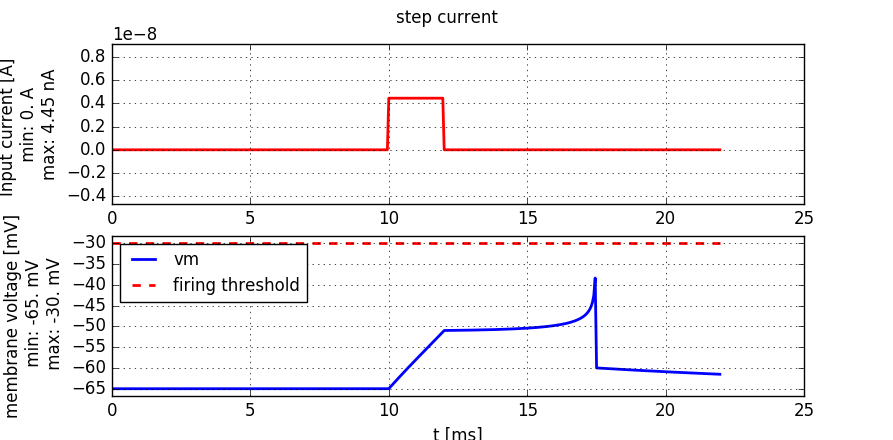

The Exponential Integrate-and-Fire model
========================================

**Book chapters**

The Exponential Integrate-and-Fire model is introduced in `Chapter 5 Section 2 <http://neuronaldynamics.epfl.ch/online/Ch5.S2.html>`_

**Python classes**

The module :mod:`.exponential_integrate_fire.exp_IF` implements the dynamics given in the book (equation 5.6).

   A short pulse current of 2ms duration is injected into an Exponential-Integrate-and-Fire neuron. The current amplitude is just sufficient to elicit a spike.

To get started, copy the following code into a Jupyter notebook. It follows a common pattern used in these exercises: use the input_factory to get a specific current, inject it into the neuron model we provide, and finally use the plot_tools to visualize the state variables:

.. code-block:: py

    % matplotlib inline
    import brian2 as b2
    import matplotlib.pyplot as plt
    import neurodynex.exponential_integrate_fire.exp_IF as exp_IF
    from neurodynex.tools import plot_tools, input_factory

    input_current = input_factory.get_step_current(
        t_start=20, t_end=120, unit_time=b2.ms, amplitude=0.8 * b2.namp)

    state_monitor, spike_monitor = exp_IF.simulate_exponential_IF_neuron(
        I_stim=input_current, simulation_time=200*b2.ms)

    plot_tools.plot_voltage_and_current_traces(
        state_monitor, input_current,title="step current",
        firing_threshold=exp_IF.FIRING_THRESHOLD_v_spike)
    print("nr of spikes: {}".format(spike_monitor.count[0]))

Note that you can change all parameters of the neuron by using the named parameters of the function :func:`.simulate_exponential_IF_neuron`. If you do not specify any parameter, the default values are used (see next code block). You can access these variables in your code by prefixing them with the module name (for example exp_IF.FIRING_THRESHOLD_v_spike).

.. code-block:: py

    MEMBRANE_TIME_SCALE_tau = 12.0 * b2.ms
    MEMBRANE_RESISTANCE_R = 20.0 * b2.Mohm
    V_REST = -65.0 * b2.mV
    V_RESET = -60.0 * b2.mV
    RHEOBASE_THRESHOLD_v_rh = -55.0 * b2.mV
    SHARPNESS_delta_T = 2.0 * b2.mV
    FIRING_THRESHOLD_v_spike = -30. * b2.mV

Exercise: rehobase threshold
----------------------------

The goal of this exercise is to study the minimal current that can elicit a spike and to understand the different notions of a firing threshold. The Exponential-Integrate-and-Fire neuron model has two threshold related parameters. They correspond to the named parameters 'v_spike' and 'v_rheobase' in the function :func:`.simulate_exponential_IF_neuron`.

Question:
~~~~~~~~~

* Modify the code example given above: Call :func:`.simulate_exponential_IF_neuron` and set the function parameter v_spike=+10mV (which overrides the default value -30mV). What do you expect to happen? How many spikes will be generated?

* Compute the minimal amplitude I_rh of a constant input current such that the neuron will elicit a spike. If you are not sure what and how to compute I_rh, have a look at `Figure 5.1 <http://neuronaldynamics.epfl.ch/online/Ch5.S1.html>`_  and `the textbox "Rheobase threshold and interpretation of parameters" <http://neuronaldynamics.epfl.ch/online/Ch5.S2.html>`_ in the book.

* Validate your result: Modify the code given above and inject a current of amplitude I_rh and 300 ms duration into the expIF neuron.

Exercise: strength-duration curve
---------------------------------

The minimal amplitude to elicit a spike depends on the duration of the current. For an infinitely long current, we've just calculated the rheobase current. For short pulses and step currents, we can "experimentally" determine the minimal currents. If we plot the amplitude versus duration, we get the strength-duration curve

Question:
~~~~~~~~~
Have a look at the following code: for the values i = 0, 2 and 6 we did not provide the minimal amplitude, but the entries in min_amp[i] are set to 0. Complete the min_amp list.

* Set the index i to 0
* Enter an informed guess into the min_amp table
* Run the script
* Depending on the plot, increase or decrease the amplitude, repeat until you just get one spike.
* Do the same for i = 2 and i = 6

At the end of the script, the strength-duration curve is plotted. Discuss it. You may want to add a log-log plot to better see the asymptotic behaviour.

.. code-block:: py

    % matplotlib inline
    import brian2 as b2
    import matplotlib.pyplot as plt
    import neurodynex.exponential_integrate_fire.exp_IF as exp_IF
    from neurodynex.tools import plot_tools, input_factory

    i=1  #change i and find the value that goes into min_amp
    durations = [1,   2,    5,  10,   20,   50, 100]
    min_amp =   [0., 4.42, 0., 1.10, .70, .48, 0.]

    t=durations[i]
    I_amp = min_amp[i]*b2.namp
    title_txt = "I_amp={}, t={}".format(I_amp, t*b2.ms)

    input_current = input_factory.get_step_current(t_start=10, t_end=10+t-1, unit_time=b2.ms, amplitude=I_amp)

    state_monitor, spike_monitor = exp_IF.simulate_exponential_IF_neuron(I_stim=input_current, simulation_time=(t+20)*b2.ms)

    plot_tools.plot_voltage_and_current_traces(state_monitor, input_current,
                                               title=title_txt, firing_threshold=exp_IF.FIRING_THRESHOLD_v_spike,
                                              legend_location=2)
    print("nr of spikes: {}".format(spike_monitor.count[0]))

    plt.plot(durations, min_amp)
    plt.title("Strength-Duration curve")
    plt.xlabel("t [ms]")
    plt.ylabel("min amplitude [nAmp]")
