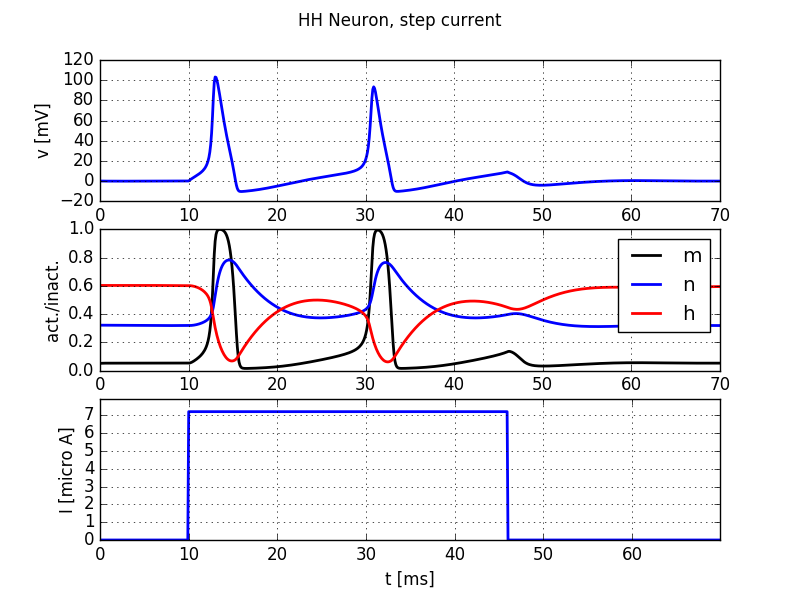

Numerical integration of the HH model of the squid axon
=======================================================

**Book chapters**

See `Chapter 2 Section 2 <Chapter_>`_ on general information about
the Hodgkin-Huxley equations and models.

.. _Chapter: http://neuronaldynamics.epfl.ch/online/Ch2.S2.html

**Python classes**

The :mod:`.hodgkin_huxley.HH` module contains all code required for this exercise. It implements a Hodgkin-Huxley neuron model.
At the beginning of your exercise solutions, import the modules and run the demo function.

.. code-block:: py

    %matplotlib inline  # needed in Jupyter notebooks, not in Python scripts.
    import brian2 as b2
    import matplotlib.pyplot as plt
    import numpy as np
    from neurodynex.hodgkin_huxley import HH
    from neurodynex.tools import input_factory

    HH.getting_started()

   Step current injection into a Hodgkin-Huxley neuron

Exercise: step current response
-------------------------------
We study the response of a Hodgkin-Huxley neuron to different input currents. Have a look at the documentation of the functions :func:`.HH.simulate_HH_neuron` and :func:`.HH.plot_data` and the module :mod:`neurodynex.tools.input_factory`.

Question
~~~~~~~~

What is the lowest **step current** amplitude I_min for generating at least one spike? Determine the value by trying different input amplitudes in the code fragment:

.. code-block:: py

    current = input_factory.get_step_current(5, 100, b2.ms, I_min *b2.uA)
    state_monitor = HH.simulate_HH_neuron(current, 120 * b2.ms)
    HH.plot_data(state_monitor, title="HH Neuron, minimal current")

Question
~~~~~~~~

What is the lowest step current amplitude to generate repetitive firing?

Exercise: slow and fast ramp current
------------------------------------
The minimal current to elicit a spike does not just depend on the amplitude I or on the total charge Q of the current, but on the "shape" of the current. Let's see why:

Question
~~~~~~~~
Inject a slow ramp current into a HH neuron. The current has amplitude 0A at t in [0, 5] ms and linearly increases to an amplitude `I_min_slow` at t=50ms. At t>50ms, the current is set to 0A. What is the minimal amplitude I_min_slow to trigger one spike (vm>50mV)?

.. code-block:: py

    slow_ramp_current = input_factory.get_ramp_current(5, 50, b2.ms, 0.*b2.uA, I_min_slow *b2.uA)

Question
~~~~~~~~
Now inject a fast ramp current into a HH neuron. The current has amplitude 0 at t in [0, 5] ms and linearly increases to an amplitude I_min_fast at t=10ms. At t>10ms, the current is set to 0A. What is the minimal amplitude I_min_fast to trigger one spike? Note: Technically the input current is implemented using a TimedArray. For a short, steep ramp, the one milliseconds discretization for the current is not high enough. You can create a more fine resolution:

.. code-block:: py

    fast_ramp_current = input_factory.get_ramp_current(50, 100, 0.1*b2.ms, 0.*b2.uA, I_min_fast *b2.uA)

Question
~~~~~~~~
Compare the two previous results. By looking at the gating variables m,n, and h, can you explain the reason for the differences in that "current threshold"? Hint: have a look at `Chapter 2 Figure 2.3 b <Chapter_>`_

Exercise: Rebound Spike
-----------------------
A HH neuron can spike not only if it receives a sufficiently strong depolarizing input current but also after a hyperpolarizing current. Such a spike is called a *rebound spike*.

Question
~~~~~~~~
Inject a hyperpolarizing step current ``I_amp = -1 uA`` for 20ms into the HH neuron. Simulate the neuron for 50 ms and plot the voltage trace and the gating variables. Repeat the simulation with ``I_amp = -5 uA``  What is happening here? To which gating variable do you attribute this rebound spike?

Exercise: Brian implementation of a HH neuron
---------------------------------------------

In this exercise you will learn to work with the Brian2 model equations. To do so, get the source code of the function  :func:`.HH.simulate_HH_neuron` (follow the link to the documentation and then click on the [source] link). Copy the function code and paste it into your Jupyter Notebook. Change the function name from simulate_HH_neuron to a name of your choice, for example simulate_modified_HH_neuron(). Have a look at the source code and find the conductance parameters gK and gNa.

Question
~~~~~~~~
In the source code of your function simulate_modified_HH_neuron, change the density of sodium channels. Increase it by a factor of 1.4. Stimulate this modified neuron with a step current.

* What is the current threshold for repetitive spiking? Explain.
* Run a simulation with no input current to determine the resting potential of the neuron. Bonus: link your observation to the  Goldman–Hodgkin–Katz voltage equation.
* If you increase the sodium conductance further, you can observe repetitive firing even in the absence of input, why?

