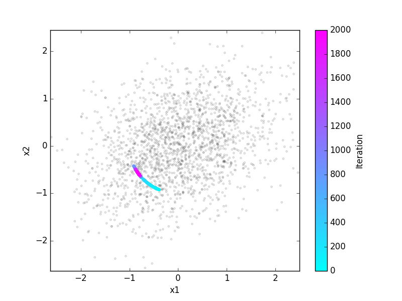

Oja's hebbian learning rule
===========================

**Book chapters**

See `Chapter 19 Section 2 <Chapter_>`_ on the learning rule of Oja.

.. _Chapter: http://neuronaldynamics.epfl.ch/online/Ch19.S2.html#SS1.p6

   Grey points: Datapoints (two presynaptic firing rates, presented sequentially in random order). Colored points:   weight change under Oja's rule.

**Python classes**

The :mod:`.ojas_rule.oja` module contains all code required for this exercise.
At the beginning of your exercise solution file, import the contained functions by

.. code-block:: py

	import neurodynex.ojas_rule.oja as oja

You can then simply run the exercise functions by executing, e.g.

.. code-block:: py

	cloud = oja.make_cloud()  # generate data points
	wcourse = oja.learn(cloud)  # learn weights and return timecourse

A complete script using these functions could look like this:

.. code-block:: py

	%matplotlib inline  # used for Jupyter Notebook
	import neurodynex.ojas_rule.oja as oja
	import matplotlib.pyplot as plt

	cloud = oja.make_cloud(n=200, ratio=.3, angle=60)
	wcourse = oja.learn(cloud, initial_angle=-20, eta=0.04)
	plt.scatter(cloud[:, 0], cloud[:, 1], marker=".", alpha=.2)
	plt.plot(wcourse[-1, 0], wcourse[-1, 1], "or", markersize=10)
	plt.axis('equal')
	plt.figure()
	plt.plot(wcourse[:, 0], "g")
	plt.plot(wcourse[:, 1], "b")
	print("The final weight vector w is: ({},{})".format(wcourse[-1,0],wcourse[-1,1]))

Exercise: getting started
-------------------------
The figure below shows the configuration of a neuron learning from the joint input of two presynaptic neurons. Run the above script. Make sure you understand what the functions are doing.

Question: The norm of the weights
~~~~~~~~~~~~~~~~~~~~~~~~~~~~~~~~~
* Run the script with a large learning rate eta = 0.2. What do you observe?

* Modify the script: plot the time course of the norm of the weights vector.

.. figure:: exc_images/Oja_setup.png
   :align: center
   :scale: 30 %

   One linear neuron gets input from two presynaptic neurons.

Exercise: Circular data
-----------------------

Now we study Oja's rule on a data set which has no correlations.
Use the functions :func:`make_cloud <.ojas_rule.oja.make_cloud>` and :func:`learn <.ojas_rule.oja.learn>` to get the timecourse for weights that are learned on a **circular** data cloud (``ratio=1``). Plot the time course
of both components of the weight vector. Repeat this many times (:func:`learn <.ojas_rule.oja.learn>` will choose random initial conditions on each run), and plot this into the same plot. Can you explain what happens? Try different learning rates eta.

Exercise: What is the neuron leaning?
-------------------------------------

* Repeat the previous question with an **elongated** elliptic data cloud (e.g. ``ratio=0.3``). Again, repeat this several times.

* What difference in terms of learning do you observe with respect to the circular data clouds?

* The "goal" of the neuron is not to change weights, but to produce a meaningful output y. After learning, what does the output y tell about the input?

* Take the final weights [w31, w32], then calculate a single input vector (v1=?, v2=?) that leads to a **maximal** output firing y. Constrain your input to norm([v1,v2]) =1.

* Calculate an input which leads to a **minimal** output firing y.

Exercise: Non-centered data
---------------------------

The above exercises assume that the input activities can be negative (indeed the inputs were always statistically centered). In actual neurons, if we think of their activity as their firing rate, this cannot be less than zero.

Try again the previous exercise, but applying the learning rule on a noncentered data cloud. E.g., use ``cloud = (3,5) + oja.make_cloud(n=1000, ratio=.4, angle=-45)``, which centers the data around ``(3,5)``. What conclusions can you draw? Can you think of a modification to the learning rule?

Bonus: 3 D
----------

By modifying the source code of the given functions, try to visualize learning from a 3 dimensional time series. Here's an example of a 3D scatter plot: `scatter3d <http://matplotlib.org/examples/mplot3d/scatter3d_demo.html>`_

.. figure:: exc_images/Oja_3D.png
   :align: center
   :scale: 60 %

   Learning from a 3D input.
