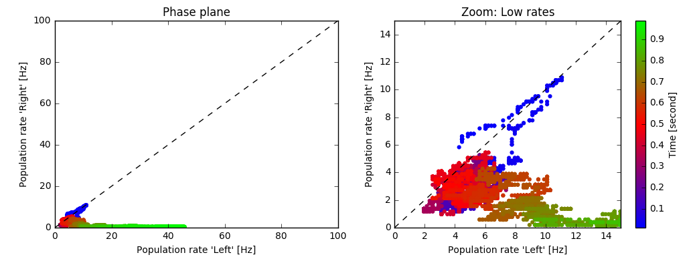

Perceptual Decision Making (Wong & Wang)
========================================

In this exercise we study decision making in a network of competing populations of spiking neurons. The network has been proposed by Wong and Wang in 2006 [1] as a model of decision making in a visual motion detection task. The decision making task and the network are described in the book and in the original publication (see :ref:`location-references` [1]).

To get a better understanding of the network, we recommend to solve the exercise :doc:`spatial-working-memory` first.

The parameters of our implementation differ from the original paper. In particular, the default network simulates only 512 spiking neurons which leads to relatively short simulation time even on less powerful computers.

    Phase plane. Each point represents the firing rates of the two subpopulation "Left" and "Right" at a given point in time (averaged over a short time window). The color encodes time. In this example, the decision "Left" is made after about 800 milliseconds.

**Book chapters**

Read the introduction of chapter `16, Competing populations and decision making  <http://neuronaldynamics.epfl.ch/online/Ch16.html>`_. To understand the mechanism of decision making in a network, read `16.2, Competition through common inhibition <http://neuronaldynamics.epfl.ch/online/Ch16.S2.html>`_.

If you have access to a scientific library, you may also want to read the original publication, :ref:`location-references` [1].

**Python classes**

The module :mod:`.competing_populations.decision_making` implements the network adapted from [1, 2]. To get started, call the function  :func:`.competing_populations.decision_making.getting_started` or copy the following code into a Jupyter notebook.

.. code-block:: py

    %matplotlib inline
    from neurodynex.competing_populations import decision_making

    decision_making.getting_started()

Exercise: The network implementation
------------------------------------
Before we can analyse the decision making process and the simulation results, we first need to understand the structure of the network and how we can access the state variables of the respective sub-populations.

.. figure:: exc_images/WorkingMemory_NetworkStructure.png
    :align: center
    :width: 65%

    Network structure. REDO this Figure, show 4 populations.

Question: Understanding Brian2 Monitors
~~~~~~~~~~~~~~~~~~~~~~~~~~~~~~~~~~~~~~~

The network shown in the figure above is implemented in Brian2 in the function  :func:`.competing_populations.decision_making.getting_started`. Each subpopulation is a `Brian2 NeuronGroup <http://brian2.readthedocs.io/en/stable/user/models.html>`_. Look at the source code of the function :func:`.competing_populations.decision_making.getting_started` to answer the following questions:

* For each of the four sub-populations, find the variable name of the corresponding `NeuronGroup <http://brian2.readthedocs.io/en/stable/user/models.html>`_.

* Each NeuronGroup is monitored with a `Brian2 RateMonitor <http://brian2.readthedocs.io/en/stable/user/recording.html>`_, a `Brian2 SpikeMonitor <http://brian2.readthedocs.io/en/stable/user/recording.html>`_, and a `Brian2 StateMonitor <http://brian2.readthedocs.io/en/stable/user/recording.html>`_. Find the variable names for those monitors. Have a look at the `Brian2 documentation <http://brian2.readthedocs.io/en/stable/user/recording.html>`_ if you are not familiar with the concept of monitors.

* Which state variable of the neurons is recorded by the StateMonitor?

Question: Accessing a dictionary to plot the population rates
~~~~~~~~~~~~~~~~~~~~~~~~~~~~~~~~~~~~~~~~~~~~~~~~~~~~~~~~~~~~~

The monitors are returned in a `Python dictionary <https://docs.python.org/3/tutorial/datastructures.html?highlight=dictionary#dictionaries>`_ providing access to objects by name. Read the `Python documentation <https://docs.python.org/3/tutorial/datastructures.html?highlight=dictionary#dictionaries>`_ and look at the implementation of the function :func:`.competing_populations.decision_making.getting_started` to learn how dictionaries are used.

* Extend the following code block to include plots for the all four subplopulations.
* Run the simulation for 800ms. What are the "typical" population rates of the four populations towards the end of the simulation? (In case the network did not decide, run the simulation again).
* Without running the simulation again, but by using the same ``results`` `dictionary <https://docs.python.org/3/tutorial/datastructures.html?highlight=dictionary#dictionaries>`_, plot the rates using different values of ``avg_window_width``.

 .. code-block:: py

    import brian2 as b2
    from neurodynex.tools import plot_tools
    from neurodynex.competing_populations import decision_making
    import matplotlib.pyplot as plt

    results = decision_making.sim_decision_making_network(t_stimulus_start= 50. * b2.ms,
                                                          coherence_level=-0.6, max_sim_time=1000. * b2.ms)
    plot_tools.plot_network_activity(results["rate_monitor_A"], results["spike_monitor_A"],
                                     results["voltage_monitor_A"], t_min=0. * b2.ms, avg_window_width=2. * b2.ms,
                                     sup_title="Left")
    plot_tools.plot_network_activity(results["rate_monitor_B"], results["spike_monitor_B"],
                                     results["voltage_monitor_B"], t_min=0. * b2.ms, avg_window_width=2. * b2.ms,
                                     sup_title="Right")
    plt.show()

Remark: The parameter ``avg_window_width`` is passed to the function `RateMonitor.smooth_rate() <http://brian2.readthedocs.io/en/2.0.1/user/recording.html#recording-population-rates>`_ . This function is useful to solve one of the next exercises.

.. code-block:: py

    avg_window_width = 123*b2.ms
    sr = results["rate_monitor_A"].smooth_rate(window="flat", width=avg_window_width)/b2.Hz

Exercise: Stimulating the decision making circuit
-------------------------------------------------
The input stimulus is implemented by two inhomogenous Poisson processes: The sub-population "Left" and "Right" receive input from two different PoissonGroups. The input has a ``coherence level c`` and is noisy. We have implemented this in the following way: every 30ms, the firing rates :math:`\nu_{left}` and :math:`\nu_{right}` of each of the two PoissonGroups are drawn from a normal distribution:

.. math::
   :label: eq1

   \nu_{left} &\sim& \mathcal{N}(\mu_{left},\,\sigma^{2})\\
   \nu_{right} &\sim& \mathcal{N}(\mu_{right},\,\sigma^{2})\\
   \mu_{left} &=& \mu_0 * (0.5 + 0.5c)\\
   \mu_{right} &=& \mu_0 * (0.5 - 0.5c)\\
   c &\in& [-1, +1]

The coherence level ``c``, the maximum mean :math:`\mu_0` and the variance :math:`\sigma^{2}` are parameters of the function :func:`.competing_populations.decision_making.sim_decision_making_network`.

Question: Coherence Level
~~~~~~~~~~~~~~~~~~~~~~~~~

* Given the equation above and the documentation of the function :func:`.competing_populations.decision_making.sim_decision_making_network`, what are the mean firing rates :math:`\nu_{left}` and :math:`\nu_{right}` for each of the following values of c: c=-1, c= 0, c= +1

* How does the default noise level :math:`\sigma^{2}` compare to the difference in the mean?

Question: Input stimuli with different coherence levels
~~~~~~~~~~~~~~~~~~~~~~~~~~~~~~~~~~~~~~~~~~~~~~~~~~~~~~~

Run a few simulations with ``c=-0.3`` and ``c=+1``. Then plot the network activity.

* Does the network always make the correct decision?
* Looking at the population rates, how long does it take the network to make a decision?

Exercise: Visualizing the population rates in a phase plane
-----------------------------------------------------------

We can visualize the dynamics of the decision making process by plotting the activities of the two sub population representing "Left" / "Right" in a phase plane (see figure at the top of this page).

Question: Plotting the phase plane
~~~~~~~~~~~~~~~~~~~~~~~~~~~~~~~~~~

* Write a function that takes two `RateMonitors <http://brian2.readthedocs.io/en/2.0.1/user/recording.html#recording-population-rates>`_ and creates a plot similar to the one given above.

* Add a parameter ``avg_window_width`` to your function (same semantics as in the exercise above.). Run a few simulations and plot the phase plane for different values of ``avg_window_width``.

* Think about a decision criterion. What are appropriate values for ``avg_window_width`` and some ``rate threshold`` to detect a decision from the two rates?

Question: Implementing a decision criterion
~~~~~~~~~~~~~~~~~~~~~~~~~~~~~~~~~~~~~~~~~~~

* Using your insights from the previous questions, implement a function **get_decision_time** that takes two `RateMonitors <http://brian2.readthedocs.io/en/2.0.1/user/recording.html#recording-population-rates>`_ , a ``avg_window_width`` and a ``rate_threshold``. The function should return a tuple (decision_time_Left, decision_time_right). The decision time is the time index when some decision boundary is crossed. Possible return values are (1234.5ms, 0ms) for decison "Left", (0ms, 987.6ms) for decision "Right" and (0ms, 0ms) for the case when no decision is made within the simulation time. A return value like (123ms, 456ms) is an error and occurs if your the function is called with inappropriate values for ``avg_window_width`` and ``rate_threshold``.

 The following code block shows how your function should be called.

.. code-block:: py
    >> get_decision_time(results["rate_monitor_A"], results["rate_monitor_B"], avg_window_width=123*b2.ms, rate_threshold=456*b2.Hz)
    >> (0.543 * second, 0. * second)

The following code fragments could be useful:

.. code-block:: py
    smoothed_rates_A = (rate_monitor_A.smooth_rate(window="flat", width=avg_window_width) / b2.Hz)
    idx_A = numpy.argmax(smoothed_rates_A > rate_threshold/b2.Hz)
    t_A = idx_A * b2.defaultclock.dt

Run a few simulations to test your function.

Exercise: Percent-correct and Decision-time as a function of coherence level
----------------------------------------------------------------------------
We now systematically investigate how the coherence level influences the decision making procsess. Running multiple repetitions for different coherence levels, we can study how well the network is able to make correct decisions.

You can use your function **get_decision_time** and pass it to :func:`.competing_populations.decision_making.run_multiple_simulations` as shown here:

.. code-block:: py

    coherence_levels = [0., 1.]
    nr_repetitions = 3

    time_to_A, time_to_B, count_A, count_B, count_No = decision_making.run_multiple_simulations(get_decision_time,coherence_levels, nr_repetitions, max_sim_time=??, rate_threshold=?? avg_window_width=??)

The return value ``time_to_A`` is a matrix of size [nr_of_c_levels x nr_of_repetitions]. ``count_A`` is the number of times the network decides for A (= "Left" by convention). The other values are analogous. When calling run_multiple_simulations, you have to set at least the parameters ``max_sim_time``, ``rate_threshold`` and ``avg_window_width``.

Question: Percent-Correct, Time-to-decision, Time-to-wrong-decision
~~~~~~~~~~~~~~~~~~~~~~~~~~~~~~~~~~~~~~~~~~~~~~~~~~~~~~~~~~~~~~~~~~~

Using :func:`.competing_populations.decision_making.run_multiple_simulations`, run at least 5 simulations for 2 different levels of coherence. If you have sufficient time/computing-power, you should run more repetitions and more levels, and you could even try larger networks.

* Visualize ``Percent-correct`` versus ``coherence-level``. You can treat the case "no decision" as "wrong decision".

* Visualize ``Time to decision`` versus ``coherence-level``. Ignore the case "no decision".

* For each coherence-level, compare ``Time to correct decision`` to ``Time to wrong decision``. Ignore the case "no decision".

* Discuss your results

.. _location-references:

**References**
--------------

[1] Wong, K.-F. & Wang, X.-J. A Recurrent Network Mechanism of Time Integration in Perceptual Decisions. J. Neurosci. 26, 1314–1328 (2006).

[2] Parts of this exercise and parts of the implementation are inspired by material from *Stanford University, BIOE 332: Large-Scale Neural Modeling, Kwabena Boahen & Tatiana Engel, 2013*, online available.
