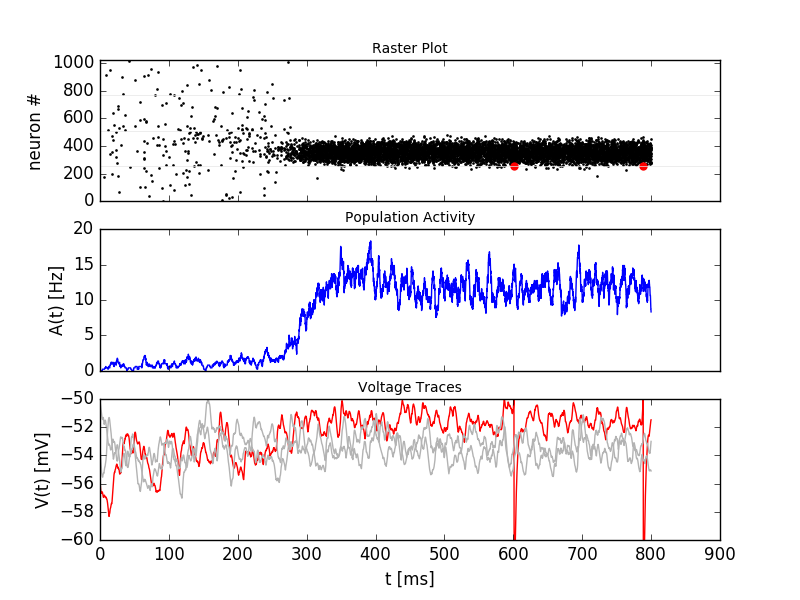
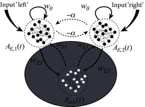

Spatial Working Memory (Compte et. al.)
=======================================

In this exercise we study a model of spatial working memory. The model has been introduced by Compte et. al. [1]. The parameters used here differ from the original paper. They are changed such that we can still study some effects while simulating a small network.

   *Top:* A weak stimulus, centered at 120deg, is applied to a subset of the excitatory population from t=200ms to t=400ms (blue box in top panel). This creates an activity bump in the excitatory subpopulation. The activity sustains after the end of the stimulation. The active neurons have a preferred direction close to the stimulus location. *Middle:* The population activity increases over time when the stimulus is applied. *Bottom:* Voltage traces for three selected neurons. The spikes of the red neuron are visible in the top and bottom panel.

Figure `18.4 <http://neuronaldynamics.epfl.ch/online/Ch18.S1.html>`_ in chapter 18.1 shows the kind of ring model we are studying here.

**Book chapters**

Read the introduction of chapter `18, Cortical field models for perceptions  <http://neuronaldynamics.epfl.ch/online/Ch18.html>`_ and the chapters `18.1 <http://neuronaldynamics.epfl.ch/online/Ch18.S1.html>`_, `18.2 <http://neuronaldynamics.epfl.ch/online/Ch18.S2.html>`_ and `18.3 <http://neuronaldynamics.epfl.ch/online/Ch18.S3.html>`_ . Figure `18.4 <http://neuronaldynamics.epfl.ch/online/Ch18.S1.html>`_ in chapter 18.1 shows the kind of ring model we are studying here.

If you have access to a scientific library, you may also want to read the original publication [1].

**Python classes**

The module :mod:`.working_memory_network.wm_model` implements a working memory circuit adapted from [1, 2]. To get started, call the function  :func:`.working_memory_network.wm_model.getting_started` or copy the following code into a Jupyter notebook.

.. code-block:: py

    %matplotlib inline
    from neurodynex.working_memory_network import wm_model
    from neurodynex.tools import plot_tools
    import brian2 as b2

    wm_model.getting_started()

Exercise: Spontanous bump formation
-----------------------------------
We study the structure and activity of the following network.

    Network structure. Look at Figure `18.4 in chapter 18.1 <http://neuronaldynamics.epfl.ch/online/Ch18.S1.html>`_ to see how the excitatory population is spatially arranged on a ring and has a specific connectivity profile. In our implementation, every excitatory neuron receives unstructured input from all inhibitory neurons and structured input from all excitatory neurons. The inhibitory neurons receive unstructured input from all excitatory and all inhibitory neurons.

Question: External poisson population
~~~~~~~~~~~~~~~~~~~~~~~~~~~~~~~~~~~~~
Parameters that are not explicitly specified are set to default values. Read the documentation of the function :func:`.working_memory_network.wm_model.simulate_wm` to answer the following questions:

* By default, how many neurons are in the external poisson population?
* Using the default parameters, what is the average number of spikes/second an excitatory neuron receives from the external population?

From the documentation, follow the 'source' link to go to the implementation of :func:`.simulate_wm`. Answer the following questions about the external poisson population:

* We use the `Brian2 PoissonInput <http://brian2.readthedocs.io/en/stable/user/input.html>`_ to implement the external population. Which post-synaptic variable is targeted by a presynaptic (poisson) spike?
* The dynamics of that variable are defined in the equations ``excit_lif_dynamics`` (still in the source code of simulate_wm). What is the time-scale of that variable (in milliseconds)?

Question: Unstructured input
~~~~~~~~~~~~~~~~~~~~~~~~~~~~
Run the following code to simulate a network that receives unstructured poisson input.

.. code-block:: py

    %matplotlib inline
    import brian2 as b2
    from neurodynex.working_memory_network import wm_model
    from neurodynex.tools import plot_tools

    rate_monitor_excit, spike_monitor_excit, voltage_monitor_excit, idx_monitored_neurons_excit, rate_monitor_inhib, spike_monitor_inhib, voltage_monitor_inhib, idx_monitored_neurons_inhib, w_profile = wm_model.simulate_wm(sim_time=800. * b2.ms, poisson_firing_rate=1.3 * b2.Hz, sigma_weight_profile=20., Jpos_excit2excit=1.6)
    plot_tools.plot_network_activity(rate_monitor_excit, spike_monitor_excit, voltage_monitor_excit, t_min=0. * b2.ms)

* Without coding, from the plot: What is the population activity (mean firing rate) of the excitatory population at different points in time?
* Change the firing rate of the external population to 2.2Hz. What do you observe?
* Run the simulation a few times with r_ext = 2.2 Hz. Describe your observations.

Question: Weight profile
~~~~~~~~~~~~~~~~~~~~~~~~

The function :func:`.simulate_wm` takes two parameters to define the weight profile: ``sigma_weight_profile`` and ``Jpos_excit2excit``. After the simulation you can access the return value weight_profile_45. This array contains the synaptic weights between the one postsynaptic neuron whose preferred direction is 45deg and all other (presynaptic) neurons. Our choice of 45deg is arbitrary, the profile for other neurons are shifted versions of this one.

* Run the following code to simulate the network.
* Increase ``Jpos_excit2excit``. How does the weight profile change (look at short and long ranges)?
* Simulate with ``Jpos_excit2excit`` = 2.3. What do you observe?
* How does the weight profile change with the parameter ``sigma_weight_profile``? How does the bump change with this parameter?

.. code-block:: py

    %matplotlib inline
    import brian2 as b2
    from neurodynex.working_memory_network import wm_model
    from neurodynex.tools import plot_tools
    import matplotlib.pyplot as plt

    rate_monitor_excit, spike_monitor_excit, voltage_monitor_excit, idx_monitored_neurons_excit, rate_monitor_inhib, spike_monitor_inhib, voltage_monitor_inhib, idx_monitored_neurons_inhib, weight_profile_45 = wm_model.simulate_wm(sim_time=800. * b2.ms, poisson_firing_rate=1.3 * b2.Hz, sigma_weight_profile=20., Jpos_excit2excit=1.6)
    plot_tools.plot_network_activity(rate_monitor_excit, spike_monitor_excit, voltage_monitor_excit, t_min=0. * b2.ms)

    plt.figure()
    plt.plot(weight_profile_45)

Exercise: Network response to a structured input stimulus
---------------------------------------------------------
We now apply a stimulus to a subset of the excitatory population. The network has the property of integrating input over time and keep a memory of the input stimulus. Using the following code, you can run a simulation with a weak input stimulus.

.. code-block:: py

    import brian2 as b2
    from neurodynex.working_memory_network import wm_model
    from neurodynex.tools import plot_tools
    import matplotlib.pyplot as plt

    rate_monitor_excit, spike_monitor_excit, voltage_monitor_excit, idx_monitored_neurons_excit, rate_monitor_inhib, spike_monitor_inhib, voltage_monitor_inhib, idx_monitored_neurons_inhib, w_profile = wm_model.simulate_wm(stimulus_center_deg=120, stimulus_width_deg=30, stimulus_strength=.06 * b2.namp, t_stimulus_start=100 * b2.ms, t_stimulus_duration=200 * b2.ms, sim_time=500. * b2.ms)
    fig, ax_raster, ax_rate, ax_voltage = plot_tools.plot_network_activity(rate_monitor_excit, spike_monitor_excit, voltage_monitor_excit, t_min=0. * b2.ms)
    plt.show()

Question: Integration of input
~~~~~~~~~~~~~~~~~~~~~~~~~~~~~~
Run the stimulation given above. Then answer the following questions qualitatively (by eye, from the raster plot)

* At which time can you identify a change in the population activity? How does that compare to the time when the stimulus is applied?
* What is the population activity at the end of the simulation?
* For the time point t=400ms, sketch the firing rate across the population (neuron index on the x-axis, per-neuron firing rate on the y-axis).

* Increase the stimulus strength to 0.5namp. What happens when the stimulus stops?
* Increase the stimulus width to 60deg (stimulus_strength=0.1 * b2.namp, stimulus center = 120deg). How does the bump shape change?

Question: Role of the inhibitory population
~~~~~~~~~~~~~~~~~~~~~~~~~~~~~~~~~~~~~~~~~~~
We can remove the inhibitory population by setting its size to the minimal size N_inhibitory = 1. If we also deactivate the external input we can study the effect of the recurrent weights within the excitatory population:

Parameters: N_inhibitory = 1, stimulus_strength=0.65 * b2.namp, t_stimulus_start=5 * b2.ms, t_stimulus_duration=25 * b2.ms, sim_time=80. * b2.ms

* Before running the simulation: What do you expect to see?
* Run the simulation with the given parameters. Describe your observations.

Now run again a "normal" simulation:

.. code-block:: py

    rate_monitor_excit, spike_monitor_excit, voltage_monitor_excit, idx_monitored_neurons_excit, rate_monitor_inhib, spike_monitor_inhib, voltage_monitor_inhib, idx_monitored_neurons_inhib, w_profile = wm_model.simulate_wm(stimulus_center_deg=120, stimulus_width_deg=30, stimulus_strength=.06 * b2.namp, t_stimulus_start=100 * b2.ms, t_stimulus_duration=200 * b2.ms, sim_time=500. * b2.ms)

* As for the excitatory population, plot the raster, population activity and voltage traces for the inhibitory population.
* What is the role of the inhibitory population?

Exercise: Decoding the population activity into a population vector
-------------------------------------------------------------------
In the raster plot above we see that the population of spiking neurons keeps a memory of the stimulus. In this exercise we decode the population vector (i.e. the  angle ``theta`` stored in the working memory) from the spiking activity. The population vector is defined as the **weighted (by spike counts) mean of the preferred directions of the neurons**. We access the data in the  Brian2 SpikeMonitor returned by the simulation to calculate the population vector. Read the `Brian2 documentation <http://brian2.readthedocs.io/en/stable/user/recording.html>`_ to see how one can access spike trains. Then implement the readout following the steps given here:

Mapping the neuron index onto its preferred direction
~~~~~~~~~~~~~~~~~~~~~~~~~~~~~~~~~~~~~~~~~~~~~~~~~~~~~
Write a function **get_orientation(idx_list, N)** which maps a vector of neuron indices ``idx_list`` onto a vector of preferred directions. ``idx_list`` is the subset of ``k`` monitored neurons. The second parameter ``N`` is the total number of neurons in the excitatory population. Verify your implementation by calling the function with the following example input:

.. code-block:: py

    > get_orientation([0, 1, 5, 10], 11)
    > [16.36, 49.09, 180.0, 343.64]
    >
    > get_orientation([0, 1, 499, 500, 999], 1000)
    > [0.18, 0.54, 179.82, 180.18, 359.82]

Extracting spikes from the spike monitor
~~~~~~~~~~~~~~~~~~~~~~~~~~~~~~~~~~~~~~~~
The population vector ``theta`` changes over time due to drift and diffusion which is why we are interested in ``theta(t)``. As we are dealing with spikes (discrete point events), and a small number of neurons, we have to average the population activity over some time window around t, [t_min=t - t_window_width/2, t_max =t + t_window_width/2], to get an estimate of ``theta(t)``.

Write a function ``get_spike_count(spike_monitor, spike_index_list, t_min, t_max)`` which returns an array of spike counts (one value for each neuron in ``spike_index_list``). Be careful about the indexing: ``spike_index_list`` is a list of ``k`` neuron indices in [0, N-1] while the returned array ``spike_count_list`` is of length ``k``.

The parameter ``spike_monitor`` is the spike_monitor_excit returned by the function :func:`.simulate_wm`. The following pseudo-code and fragments are useful to implement ``get_spike_count``:

.. code-block:: py

    def get_spike_count(spike_monitor, spike_index_list, t_min, t_max):
        nr_neurons = len(spike_index_list)
        spike_count_list = numpy.zeros(nr_neurons)
        spike_trains = spike_monitor.spike_trains()
        ...
        # loop over the list of neurons and get the spikes within the time window:
            (spike_trains[i]>=t_min) & (spike_trains[i]<(t_max))  # try sum(list of booleans)
        ...
    return spike_count_list

Do a plausibility check of your implementation: In one of the previous questions you have sketched the firing rates across the population at t=400ms. Use ``get_spike_count`` to plot the profile. Compare to your sketch. You can use the following code block. It's assumed you have run a simulation and the two variables ``spike_monitor_excit`` and ``idx_monitored_neurons_excit`` are defined. Then play with the ``t_window`` parameter to get an intuition for  'good' values.

.. code-block:: py

    import matplotlib.pyplot as plt

    t = 400*b2.ms  # time point of interest
    t_window = 10*b2.ms # width of the window over which the average is taken

    t_min = t-t_window/2
    t_max = t+t_window/2
    spike_counts = get_spike_count(spike_monitor_excit, idx_monitored_neurons_excit, t_min, t_max)
    spike_rates = spike_counts/(t_max-t_min)/b2.second
    plt.plot(spike_rates, ".b")
    plt.title("Bump profile in the time interval[{},{}]".format(t_min, t_max))
    plt.xlabel("Neuron index")
    plt.ylabel("Spike rate [Hz]")

Computing the population vector
~~~~~~~~~~~~~~~~~~~~~~~~~~~~~~~

 * Combine the two previous functions to calculate theta(t). For our purpose, it is sufficient to calculate a weighted mean of preferred directions. It is not necessary to correctly decode an angle close to 0deg = 360deg (You can stimulate the network at 350deg to see the problem).

 * Run a simulation and decode the population vector at the time when the **stimulation** ends. You should get a value close to the stimulus location.

 * Pack the calculation of theta(t) into a function ``get_theta_time_series`` which takes an additional parameter ``t_snapshots`` (an array of time points at which you want to decode the population vector). ``get_theta_time_series`` loops over all t_snapshots and calls ``get_spike_count``. Use your function to  readout and visualize the evolution of theta. You can take some inspiration from the following code fragment:

.. code-block:: py

    # Example how to create an array of timestamps spaced by snapshot_interval in the interval of interest.
    t_snapshots = range(
        int(math.floor((t_stimulus_start+t_stimulus_duration)/b2.ms)),  # lower bound
        int(math.floor((t_sim-t_window_width/2)/b2.ms)),  # Subtract half window. Avoids an out-of-bound error later.
        int(round(snapshot_interval/b2.ms))  # spacing between time stamps
        )*b2.ms

    # how your function get_theta_time_series could be called:
    theta_ts = get_theta_time_series(spike_monitor, idx_monitored_neurons, t_snapshots, t_window_width)

    # plot theta vs time using pyplot
    import matplotlib.pyplot as plt
    plt.plot(t_snapshots/b2.ms, theta_ts)

Exercise: Visualize the diffusion of the population vector
~~~~~~~~~~~~~~~~~~~~~~~~~~~~~~~~~~~~~~~~~~~~~~~~~~~~~~~~~~
As mentioned above, the population vector changes over time due to drift and diffusion. In our implementation, because of homogeneous network properties (equal parameters, equal weights, shared presynaptic neurons) the drift is zero.

Use your functions developed in the previous questions to study the diffusion of the population vector:

* Simulate a network of size ``N_excitatory`` = 2048. Apply a stimulus from t=100ms to t=300ms. Plot theta(t). *Note that when you increase the size of the excitatory population you also have to increase the inhibitory population and the weights (''N_inhibitory'' and ''weight_scaling_factor''). When doubling the number of presynaptic neurons, you have to scale the weights by 0.5 to keep the total synaptic input the same.*

* Repeat the simulation at least 3 times. Plot each time series theta(t) into the same figure.

* Change the size of the network to ``N_excitatory`` = 512 and redo the previous steps.

* Discuss your observations.

.. figure:: exc_images/WorkingMemory_PopulationVector2048.png
    :align: center

    Diffusion of the population vector for three different simulations.

Reading exercise: slow and fast channels
----------------------------------------

The working memory circuit we study in this exercise combines three different receptors: NMDA and AMPA at excitatory synapses, and GABA at inhibitory synapses. A crucial element for this circuit is the slow dynamics of the NMDA receptor. Read the chapters `3.1 Synapses <http://neuronaldynamics.epfl.ch/online/Ch3.S1.html>`_ and look at Figure 3.2 to understand the dynamics of the receptors.

Question:
~~~~~~~~~

The dynamics of the NMDA receptor are implemented in the function :func:`.simulate_wm`. Look for the equations ``excit_lif_dynamics`` in the source code.

* In the model used here, what is the timescale (in milliseconds) of the fast rise? What is the timescale of the slow decay?

**References**
--------------

[1] Compte, A., Brunel, N., Goldman-Rakic, P. S., & Wang, X. J. (2000). Synaptic mechanisms and network dynamics underlying spatial working memory in a cortical network model. Cerebral Cortex, 10(9), 910-923.

[2] Parts of this exercise and parts of the implementation are inspired by material from *Stanford University, BIOE 332: Large-Scale Neural Modeling, Kwabena Boahen & Tatiana Engel, 2013*, online available.
